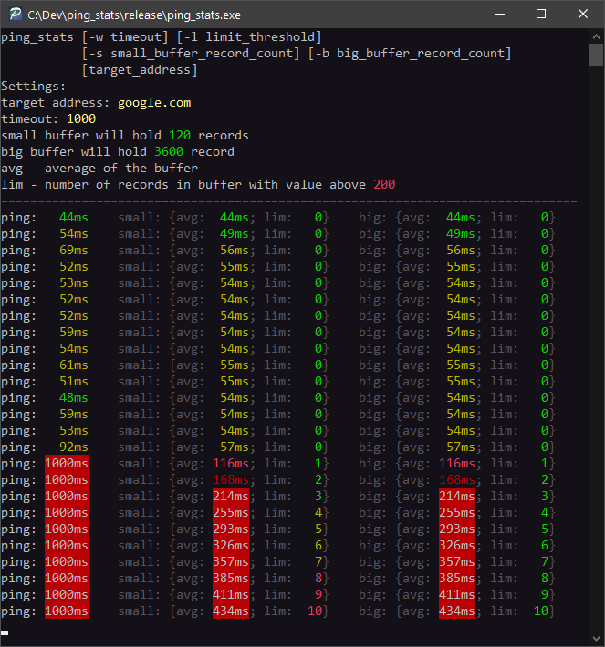

# Ping stats

Simple program that queries MS Ping and gathers some stats.  
Allows you to quickly judge your network stability over the last ~2 minutes and ~1 hour.  

> avg - average of the buffer.  
> lim - counts entries above limit value in the buffer.  

### Screenshot

